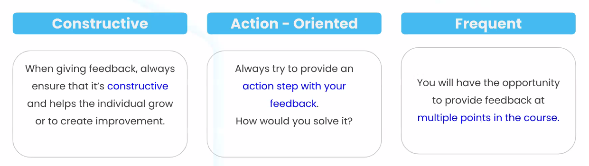

# Retrospectives

## When

- I always do one retro at the end of week1
  (this gives us a lot of valuable information)

- This is usually the only retro we do. The rest of the bootcamp we gather verbal feedback.

## Setup

- We use one of those:
  - https://app.mural.co (more flexible)
  - https://www.goretro.ai/ (more simple)
    - july24: for GoRetro.ai, you need to create an account but there's no email validation.

  <!-- 
  
  @LT: 
  - may be better to add columns one by one
    - What went well ?
    - What can be improved ?
    - Suggestions / Things to try
    - Kudos

  - limit votes: 10. (or tell them one vote per card)

  -->

- On there, we add 4 "feedback" frameworks to gather feedback in the following categories:

  - Ironhack & the bootcamp
    - Includes: Admissions, PM, Materials, LABs, Central Support...
  - Instruction team (LT + TAs)
    - Lectures, LT, TAs, classes in general ...
  - Class (we, as a group)
  - Yourself (self-assessment)
  - (extra) Gratitude Corner

## Instructions

<!-- @todo: create slides -->

Before sharing the link, explain:

- Intro (what is a retro, agile, scrum etc)

  - Waterfall vs. Agile: 
    - https://www.trustradius.com//wp-content/uploads/agilevswaterfallfromouriken.png

  - Agile (multiple sprints):
    - https://soldevelo.com/wp-content/uploads/2020/12/Agile-software-dev-1.jpeg.webp

  - Scrum framework: 
    - https://zalatni.com/wp-content/uploads/2022/04/What-is-Agile-Scrum-Framework-1024x596-1.webp

  - Scrum ceremonies: 
    - https://i.ytimg.com/vi/33Fk3r9ZSUg/maxresdefault.jpg

- Why it (a retro) is important
- How we will work (brief intro)
- How to give good feedback:
  - specific
  - constructive
  - realistic
  - focus on actionable feedback (students are busy, focus on the most important)
  - https://i.pinimg.com/originals/8b/a9/3a/8ba93a720063a635a713442e3b0697ca.png
- How to navigate (zoom in/out)
- How to add a post-it
- How to vote +1, +2...
- We start from category 1 (explain what it includes)

<!--
- Be constructive. Make sure your feedback makes us grow and improve.  
- Be action-oriented. Try to give feedback with quick wins, steps and actions in mind. How would 
-->

