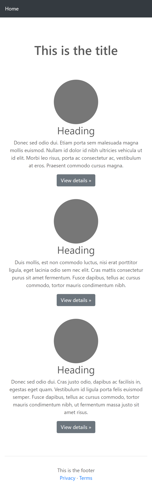

# w1d1

<!-- 

@LT:

IMPORTANT:
- Go very fast through basic concepts
- Give plenty of time for Git concepts +++
- Give plenty of time for LAB

@todo:
- improve demo/codealong (make it more interesting)

 -->

## Intro from PMs [30m]

## (skip) Icebreaker activity
  - option 1: introduce yourself
    - tell us about you
    - where you're from, background...
    - why you're doing the bootcamp
  - option 2: 2 truths 1 lie

(break)

## LT intro to bootcamp [1h]

  - Slides: https://docs.google.com/presentation/d/1rYCVx5wNFST7uh6_hknnrKtpXPVeQ29ytAxeE9mxHWI/edit?usp=sharing

(break)

## How the web works [30m]
  - Slides: https://docs.google.com/presentation/d/1mGIVU9fWTYII9sUHcIu2RYJ-2KwU6FtNnUtsyZFyiNc/edit?usp=sharing
  <!-- 
  
  @todo: 
  - simplify this a lot (some students may find this overwhelming, especially the network panel)
  - alternative: show the dev tools while we do a codealong (code much more simple)
  

  -->

## Intro Students Portal

    Notes: 
    - We will use it as a guideline 
    - You can find there interesting contents.

## html + css (follow .md files)

- HTML (project setup + html intro + shortcuts) [1h]
- CSS [1.5h]

Notes:
- Students know all the theory 
- Instead, build something together
- Opportunity to speak about good practices & common mistakes
- Example. 

## DayZero + installations (self-guided):

Fill in spreadsheet.
  

## Pair programming [10m]

## Git intro (30min. - ideally 1h)  [1h]

- git diagram: https://thepracticaldev.s3.amazonaws.com/i/128hsgntnsu9bww0y8sz.png

<!-- @todo: prepare slides git  -->

## LAB Kick-off

<!-- IMPORTANT: leave plenty of time for lab kick-off  -->

- demo with students how to work with labs.
- Explain: ticketing system

## LAB: min. 90min. (1.5h)
- Time for students to work on LAB

## Active Learning

- (in pairs) LAB | CSS Recipes clone

- General guidelines for labs/assignments: https://gist.github.com/ironhack-edu/dd3635de73a6ef07ef337bf184eda985

<!-- Ticketing system  -->
- If you get stuck or need help: [link to ticketing system]
