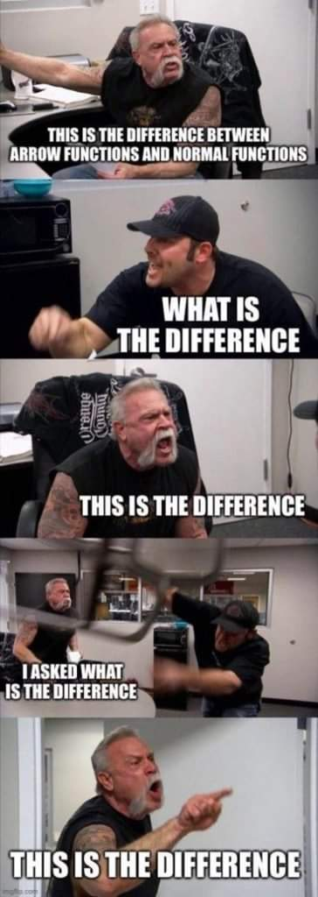
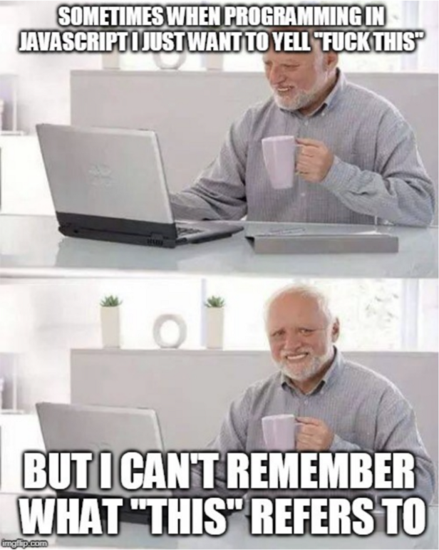

# Functions Advanced


<!--- 
  Status: complete


  Notes:
  - some concepts could even be moved for tomorrow (ex. clearTimout, clearInterval...)
  - consider doing together all ways of creating functions (ie. arrow functions can be explained after "function expressions")

--->


## Intro


- We've already seen how we can declare & use functions

    ```js
    function calcSum() {
        console.log("hello")
    }

    
    calcSum();
    ```

- This is called a function declaration (aka statement)
- pass arguments
- return

- JavaScript is a programming language with `first-class functions` (functions are treated like any other variable)
  - a function can be assigned as a value to a variable
  - a function can be passed as an argument to other functions
  - a function can be returned by another function 

> example "a function can be passed to other functions": `forEach()`


## Function Expressions

- We know that we can store a function in a variable

- Example (calc Multiplication):

    ```js
    const calcMult = function(x, y) {
        return x + y;
    };

    calcMult(2, 3);
    ```

- Compare both syntaxes
  - notice, it's a function 'without the name'.

  - a function expression is an un-named function (aka **Anonymous Function**) that is stored in the variable.


## Function declaration vs. function expression

- The syntax we use to create them is different but:
  - to call (invoke) the function, the syntax is the same
    - `doSomething()`

  - both can be reused throughout the code.

- Main difference:
  - function expression: we can not call the function before it has been created
    - makes sense: show example of the same with variables
  - function declaration: a function call can be 'before' the function declaration
    - why? Hoisting (lesson next week)


- Should I use function declarations of function expression?
  - Consistency
    - Whichever you decide to use, stick with it
    - When you join a dev team, if there's a convention, stick to it


--- 
(break)

--- 


## Timeouts & intervals

- Why?
  - Sometimes we want to perform an action after a specific time.
    - Example: display a confirmation message + hide it after 10 seconds.


- Timeout

  ```js
    setTimeout(function () {
      console.log('done!');
    }, 1000);
  ```


- Interval


- Clearing timeout / interval
  - clearTimeout()
  - clearInterval()
    - demo: clear interval after 3 iterations (solve with a counter)


## Practice: timers and intervals

  1. Create an interval that displays a counter every second
    - in the console, display: "hello 1", "hello 2", "hello 3".....
    - hint: you may want to create a counter in the parent scope (ex. `let counter = 1`)
  2. After 5 seconds, cancel that interval
  3. (Bonus) Apply what we've learned so far and try to solve it in a different way.
  4. (Bonus) Can you solve it without a setInterval? (hint: setTimeout + research "js recursive function")

  How: individual
  Time: 15min. + 5min. to check solutions.

  
  Solution 1 (checking the counter): 
  - https://stackblitz.com/edit/js-sjpn4f?file=index.js

  Solution 2 (with a timeout): 
  - https://stackblitz.com/edit/js-vhkxbm?file=index.js

  Bonus 2 (recursion):
  - https://stackblitz.com/edit/js-nbe32j?file=index.js


Note: most students find it difficult, give them 15min. and solve together.


## Callbacks I (intro)

<!--
@Luis: 
- explain the concept of a callback
- leave the examples for w2d2 (unit "Async and callbacks")
-->

- Callback = when we pass a function as an argument to another function
  - example: `forEach()`
  - example: `setTimeout()`


- Usually, when we pass one function as an argument we refer to it as a `'callback'` 

- Note: tomorrow we'll see more examples of how this can be useful.


## Anonymous functions

- An anonymous function is a function without a name.

- Why ?
  - if it will be used just in that very moment and never again in your code

- Example:
  - call setTimeout
    - create a function `sayHello` (declaration / function expression) & pass it as an argument
    - pass an anonymous function


## Arrow Functions

- Alternative syntax to create an anonymous function
- (they're a different way to create functions)
- Introduced with ES6

- Example:

  ```js
  // function expression syntax
  const sayHello = function(userName) {
    console.log(`Hello, ${userName}!`);
  };

  // arrow function syntax
  const sayGoodbye = (name) => {
    console.log(`Goodbye, ${name}!`);
  };

  ```


- Simplifying arrow functions:
  - `only one paramenter -> we can remove the parenthesys`
  - `only one line -> we can remove the curly braces & the return (return is implicit)`


- "Traditional" vs "Arrow" functions
  - quite much the same
  - which one to use: 
    - consistency
    - in some cases we'll need to use one or the other (ex. this)

- Arrow functions don't have their own bindings to `this`.

  - > Arrow functions don't have their own bindings to this, arguments, or super, and should not be used as methods.

  - "Arrow function expressions should only be used for non-method functions because they do not have their own `this`"


  ```js
  const user = {
    userName: 'alice',
    age: 30,
    sayHello: function () {
      console.log(`hello my name is ${this.userName}`);
    },
    sayGoodbye: () => {
      console.log(`goodbye my name is ${this.userName}`);
    },
  };

  user.sayHello();
  user.sayGoodbye();

  ```

- Arrow functions... "this" is the difference:


- f*** this:



## Practice: arrow function syntax

Using "Arrow Functions syntax", create the following functions:

1. A function sayHello():
  - expects zero arguments.
  - displays the message "hello world".

2. A function offerDrink():
  - expects one argument (a string with the name of a drink).
  - displays the message "hello, would you like a XXX ?".

3. A function calcAverage():
  - expects 3 arguments (numbers).
  - returns the average (note: it needs to RETURN the average)


Bonus 1: a function displayCurrentDate() (may need to do some research)
Bonus 2: play further with JavaScript dates


Time: 10min.


Solution: https://stackblitz.com/edit/js-gkzf8e?file=index.js


# Refresh: Different ways of creating functions 

Summary: function declaration (statement) vs. function expression vs. arrow function

https://stackblitz.com/edit/js-evfgcy?file=index.js


## (skip) The arguments object

<!-- skip this part (arguments object) -->

- Inside the body of a function, you can access an object called `arguments`.
- This object contains the values of the arguments passed to that function.


Example:
  ```js
      function printSomething() {
          console.log(arguments);
      }

      printSomething('hi');

      // [Arguments] { '0': 'hello' }

  ```

- It is a special kind of object called `array-like object`

  > “Array-like” means that arguments has a length property and properties indexed from zero, but it doesn't have Array's built-in methods like forEach() or map()

- Accessing it's values is a bit different.

  - One option is to convert it to an array. For example:

    ```js
    function printSomething() {
        const args = Array.from(arguments);
        console.log(args);
    }

    printSomething('hi', 'hello');

    ```

