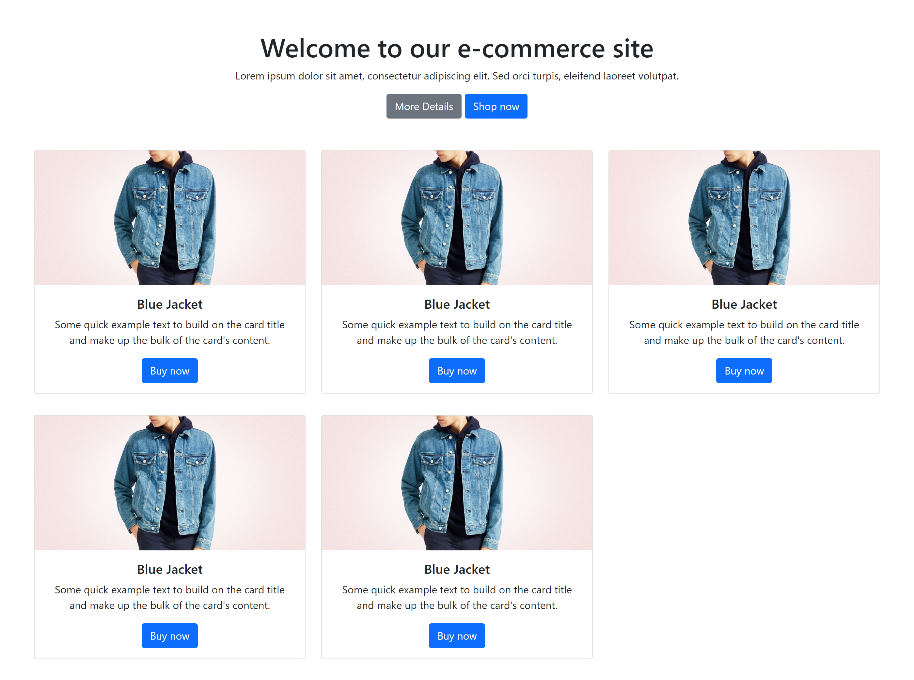

# CSS - Bootstrap Docs

<!--
Status: draft
-->

## Intro

- CSS frameworks
  - What they are (create UI)
  - Why they're useful +++++
    - Speed up develpment
  - Examples (Bootstrap, Bulma, TailwindCSS, Materialize CSS...)

- Examples: https://getbootstrap.com/docs/5.1/examples/
  - Album: https://getbootstrap.com/docs/5.1/examples/album/
  - Carousel: https://getbootstrap.com/docs/5.1/examples/carousel/
  - e-commerce checkout form: https://getbootstrap.com/docs/5.0/examples/checkout/
  - Dashboard: https://getbootstrap.com/docs/4.0/examples/dashboard/

- Bootstrap versions

## Topics

Documentation 

Initial setup

Layout
- Grid +++
  - Explain the concept of a grid system & why is important
    - Consist design
    - Harmony
    - Efficiency (easier to design, easier to implement)
Content
- Tables
Forms
- Overview
Components
- Accordion
- Buttons +
- Card +
- Dropdown button +
- Spinner +

## Codealong / Demo

Create a basic layout (eg. portfolio site / e-commerce / ...).

Mobile Design:

Desktop:

<!--

@Luis:
- Sample: "_lesson-code-samples\bootstrap-codealong"

 -->

- installation
- grid
- 3 cards
- on each card: image, text, button

## Final notes

- How CSS work:
  - we basically write html + add class names
  - the framework will do the css for us :)

- Advantages: 
  - UI Development speed

- Limitations:
  - Default components

- Disadvantages:
  - html code bloated with class names

- great option for project2 + project3
- do not change bootstrap code (override rules)

- Grid System
- CSS Reset & normalizing

