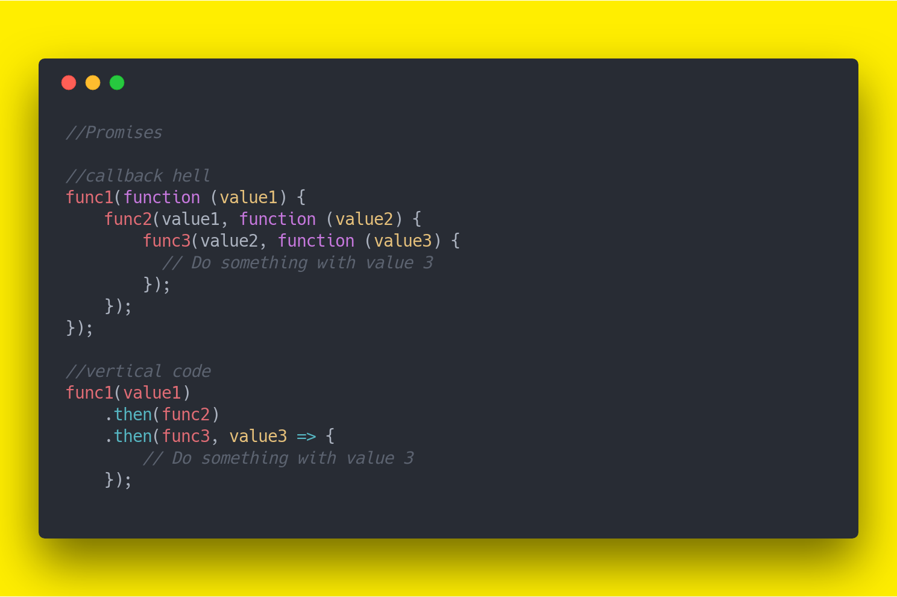
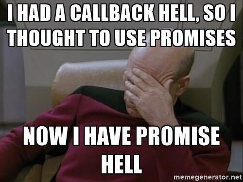

# JS - Promises


<!--


@todo: 

- improve examples & exercises

- create slides (integrate slides with the planning)
  - definition of promise
  - diagram with states of a promise
  - syntax to create promises

- roadmap (show in one of the slides):
  - quick example
  - why promises
  - creating
  - consuming: 
    -- then catch
    -- async await


-->


## Intro


What we'll see today:

- Callback hell vs. vertical code: 
  - 


- Show:
  - Summary of the patterns we'll see today
  - (callbacks vs. then/catch vs. async/await)
  - https://stackblitz.com/edit/js-mbknjw?file=index.js


- Advantage of promises: code easier to read and maintain.


## Explain "asynchronous code"

- Synchronous code: 
  - An instruction is not executed until the previous one has finished

- Asynchronous code: 
  - Next operation can occur while the previous operation is still getting processed.


> JavaScript is a synchronous language with some asynchronous functionality
> (ex. setTimout() )


## Callbacks


<!-- v1 -->
<!-- v1 -->

- v1: Start from basic example: cookDinner() + eatDinner()

  ```js
  function cookDinner() {
      console.log('dinner ready');
  }

  function eatDinner() {
      console.log('eating dinner');
  }

  cookDinner();
  eatDinner();

  ```

<!-- v2 -->
<!-- v2 -->

- v2: add timeout (dinner takes some time to be ready)
  - options to solve it:
    - add timeout in eatDinner()
    - invoke eatDinner() from cookDinner()
    - callback


  - compare:

    ```js
      cookDinner(eatDinner);
      cookDinner(eatDinner()); // with parenthesys
    ```

  - if we need to pass arguments, we can use an anonymous function.


<!-- v3 -->
<!-- v3 -->

- v3: add setTheTable()

    ```js
    function cookDinner(callback) {
      setTimeout(() => {
          console.log('dinner ready');
          callback();
      }, 2000);
    }

    function setTheTable(callback) {
      setTimeout(() => {
          console.log('table ready');
          callback();
      }, 1000);
    }

    function eatDinner() {
      console.log('eating dinner');
    }

    cookDinner(function() {
        setTheTable(eatDinner);
    });

    ```


- Example final code: https://stackblitz.com/edit/js-sysuje?file=index.js
  - cookDinner > setTheTable > callFamily > eatDinner
  - getUsersFromDB > sendEmail > updateUI
  


- Callback Hell (search images)
  - https://dev-to-uploads.s3.amazonaws.com/uploads/articles/b8euo2n7twvgh3dbuatd.jpeg


- Callback hell vs. vertical code: 
  - 


- Advantage of promises: code easier to read and maintain.


## ES6 promises / What's a "promise"

- Promises were added in ES6 to better deal with asynchronous code.

> The Promise object represents the eventual completion (or failure) of an asynchronous operation and its resulting value.


## Possible states of a Promise object

- `pending`: initial state, neither fulfilled nor rejected.
- `fulfilled`: meaning that the operation was completed successfully.
- `rejected`: meaning that the operation failed.


- diagram: https://www.javascripttutorial.net/wp-content/uploads/2020/03/JavaScript-Promise-state.png

- explain: 
  - "resolving value"
  - error message (reason)


- 


Watch: JavaScript Promises in 1 Minute (ColorCode)
- https://www.youtube.com/shorts/Yg1Wf_rFG7Q
  <!-- includes creating + consuming -->


## Consuming vs. creating promises

- Consuming vs. creating promises


## (brief) Creating Promises

- example creating/returning a promise


  ```js
  function doSomething(){
    const myPromise = new Promise(function(resolve, reject) {
      if (/* condition */) {
          resolve(/* value */);  // fulfilled successfully
      }
      else {
          reject("error details");  // rejected
      }
    });

    return myPromise;
  }

  ```


- (skip) Example creating promises:
https://stackblitz.com/edit/js-vemwgp?file=index.js


## Sneak Peek at promises


```js
doSomething()
  .then(function () {
    //...
  })
  .then(function () {
    //...
  })
  .catch(function (error) {
    //...
  });
```


## Consuming with .then().catch()


Basic example with `axios.get()`

<!--

Stackblitz + Axios v.1.x

- Bug report: https://github.com/stackblitz/core/issues/2463
- Option 1: axios@0.27.2
- Option 1: codesandbox.io (works fine with axios@1.x)

-->

Note: see how axios.get() returns a Promise:

```js
const p = axios.get();
console.log(p);
```


Final result: 
- https://stackblitz.com/edit/js-iu1s4b?file=index.js


Note: 
- after the example, introduce concepts: API + json


## Chaining Promises: .then().then().catch()

Example:
- https://jsonplaceholder.typicode.com/users
- https://jsonplaceholder.typicode.com/albums


Important:
- if we do synchronous operations, we don't need to have another .then.

Example:

```js
getUsersFromDB()
  .then(function () {
    const amount = 42;
    const total = amount * 2;
    console.log(total)
    return sendEmails();
  })
  .then(function () {
    //...
  })
  .catch(function (error) {
    //...
  });
```


- (skip) Diagram chaining promises: 
  - https://s3-eu-west-1.amazonaws.com/ih-materials/uploads/upload_9df97f56698a5721fa8b63445515c6e8.png


## Practice: JS Promises

<!-- 

@todo: 

- improve this example (use a different API)
- add bonus

-->

Initial code: https://stackblitz.com/edit/js-bznxzw?file=index.js

Using promises:

1. Send a request to get a list of all users + display in the console the number of users
  - https://jsonplaceholder.typicode.com/users
2. If the previous operation is successful, send a request to get a list of all posts + display in the console the number of posts.
  - https://jsonplaceholder.typicode.com/posts
3. If any of those operation fails, display a message in the console.

Bonus: research about .finally()

Time: 15min.

Solution: https://stackblitz.com/edit/js-iecrbf?file=index.js


## async/await


Intro:
- Async / Await is an alternative syntax to consume promises
- Introduced in ES8


Example:

  ```js
  async function getInfoFromDB() {
    try {
      await doSomething(0);
      await doSomething(1);
      await doSomething(2);    
      console.log("all worked well");
    } catch(err) {
      console.log(err)
    } 
  }
  ```


Example (get users + posts):
- https://stackblitz.com/edit/js-9q86is?file=index.js


- Notes: 
  - the async keyword transforms a function so that when the function is invoked, the return value will be wrapped in a Promise
  - The return value of an async function is always wrapped in a Promise. Put in other words, async function always returns a Promise.


- Syntax with arrow function expressions:

  ```js
  const foo = async () => {
    // do something
  }
  ```


<!--

(skip) Top-level await:
https://v8.dev/features/top-level-await
https://stackoverflow.com/a/46515787/11298742

-->


## (optional) Practice async/await


Using async/await:

https://jsonplaceholder.typicode.com/users
https://jsonplaceholder.typicode.com/posts
https://jsonplaceholder.typicode.com/albums

Time: 10min.

<!-- @todo: improve this exercise -->

(same exercise that we did with .then().catch() but using async/await)


## Compare 3 patterns (callback vs. then/catch vs. async/await)

(see summary again)


## Promises methods: Promise All


Final result: 
- https://stackblitz.com/edit/js-rgfu9j?file=index.js


Diagrams (timing):
- then().then().then(): https://images.viblo.asia/e716d79d-3c38-4957-a490-c98c4ce147c9.png
- Promise.all(): https://images.viblo.asia/21563dac-e13c-43b5-aab3-a46fff1a8125.png


Promise static methods:
- https://developer.mozilla.org/en-US/docs/Web/JavaScript/Reference/Global_Objects/Promise#static_methods


<!--

(Skip)

FAQ: can we know which promise failed?
- example with `Promise.allSettled()`: https://stackblitz.com/edit/js-bpppix?file=index.js

-->


## Bonus: .fetch()

JavaScript Fetch API in 1 Minute: 
- https://youtube.com/shorts/3ySZQXVjCoM?feature=share
- (ColorCode, 1min)

Example:
- https://stackblitz.com/edit/js-9hfrjq?file=index.js

Fetch API - JavaScript Tutorial for beginners: 
- https://www.youtube.com/watch?v=ubw2hdQIl4E
- (ColorCode, 30min)


## Extra Resources:

- JS promises in 100 Seconds: https://www.youtube.com/watch?v=RvYYCGs45L4

- Async JS Crash Course - Callbacks, Promises, Async Await (24:30): https://www.youtube.com/watch?v=PoRJizFvM7s
  - Promises
  - Promise.all()
  - fetch()
  - aynct/await


- JavaScript Promises -- Tutorial for Beginners (ColorCode, 37min.)
  - https://www.youtube.com/watch?v=TnhCX0KkPqs
  - Topics:
    - Creating promises
    - Consuming
    - Chaining
    - fetch()
    - ...


- Async Await vs. Promises - JavaScript Tutorial for beginners (ColorCode, 24min.)
  https://www.youtube.com/watch?v=spvYqO_Kp9Q


- Create your own Promises in JavaScript (dcode, 17min)
https://www.youtube.com/watch?v=Y-aWVUAul9w
  - Includes 3 examples creating promises (divide, wait, connectToDB)


