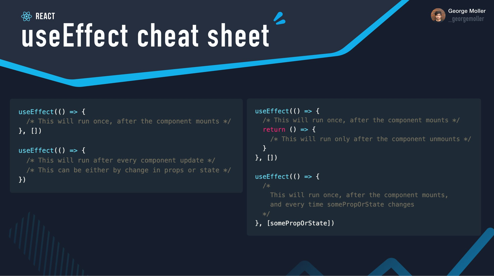

# React - Hooks & Lifecycle

<!-- 


Status: draft


@todo: 
- IMPROVE PLANNING & NOTES
- simplify theory (too many concepts for students)
- improve planning & examples
- Prepare exercise for them to practice
  - diagram mounting + updating & side effect (e.g. https://projects.wojtekmaj.pl/react-lifecycle-methods-diagram/)
  - useEffect cheatsheet 


Notes:
- explain how to make calls to an API (when component mounting & after component mounted with user interaction)
- bonus: video of why we need to do it this way
- also, improve the code for JSX & conditional rendering (some of the examples use patterns difficult for students)


-->


## Show what we are going to build today

- Demo: 
  - (old characters api url) https://react-characters-app.netlify.app/
  - (new characters api url) https://react-characters-app-demo-2.netlify.app/
- 2 main concepts:
  - API requests
  - Routing


<!-- Note: keep all code in App.js (it will make things easier for Routing) -->


## Introduce "characters API"

- What's an API


- Example 1 (rick and morty, readonly):
  - https://rickandmortyapi.com/api/character/1

- Example 2 (characters api): 
  - https://characters-api.edu.ironhack.com/characters

- See documentation: w5d4 "AXIOS | POST, PUT and DELETE request"
  - 

- explain the concept of `endpoint`
- mention the concept of: `REST API`
- test `GET` on the browser
- how can we test other endpoints ? (e.g. form with POST)

- (extra) Chrome extension to parse json: 
  - https://chromewebstore.google.com/detail/json-formatter/bcjindcccaagfpapjjmafapmmgkkhgoa


## Refresh Axios GET

Demo:
- Open Stackblitz + GET list of characters
  <!-- (note: on stackblitz, use axios v.0.27.2) -->
- Example: https://stackblitz.com/edit/js-xjq2yi?file=index.js


Diagram promises (fulfilled, rejected): 
- https://www.javascripttutorial.net/wp-content/uploads/2020/03/JavaScript-Promise-state.png


## Practice: Axios Post request


<!-- 

@LT: 

- On Stackblitz, can install `axios@0.27.2`

- Ask students to DISABLE AUTO-SAVE (so that we don't repeat names many time)
  - on CodeSandbox: https://stackoverflow.com/a/74508939/11298742

- Show documentation for axios.post()

-->


Initial code (it already has axios installed): https://stackblitz.com/edit/js-8lg6qc?file=index.js

Iteration 0:
  - Go to settings and choose "Page reload" + "Save" (so that we don't send a request every time we change the code)

Iteration 1: create a character with your name
- Using axios, create a new character in our API.
- BaseURL: https://characters-api.edu.ironhack.com
- We need to send POST request to `/characters`
- In the body of the request, send an object with `{name: "", occupation: "", weapon: ""}`

Bonus 1: get the details of a specific character
Bonus 2: update your character
Bonus 3: delete your character

Time: 12min.


Endpoints:


Hints:
  - Example with a GET request https://stackblitz.com/edit/js-xjq2yi?file=index.js
  - Documentation for POST: https://axios-http.com/docs/post_example


Solution: 
  - https://stackblitz.com/edit/js-xjq2yi?file=index.js


## Demo: introduce the syntax that we'll see today (useEffect)


Goal: display the number of users on this API,
- api url: https://jsonplaceholder.typicode.com/users


Initial code (just the App component, nothing else):
- https://stackblitz.com/edit/react-dupibekm?file=src%2FApp.js
- Note: it also has axios already installed (since it uses the classic version of stackblitz)


Final result:
- https://stackblitz.com/edit/react-k3yj123p?file=src%2FApp.js


<!-- 
Final result 2 (similar example but using the latest version of stackblitz):
https://stackblitz.com/edit/vitejs-vite-gn4dd9?file=src%2FApp.jsx
-->


## Intro: Component Lifecycle

Show how components are executed:
  - add console.log() for each component on the app we created yesterday ("popcorn time")
  - See how each function component is executed
  - See that, when `state` or `props` change, a component is re-rendered
  <!-- slides (props & state): https://docs.google.com/presentation/d/1iqYSImZj7p58ahLWryMSp00ooCCEf2cnIhjwc-pMFqw/edit?usp=sharing -->


## Intro: concept of Side-Effect

Alternative: 
- ask students to do some research
- "what is a side effect in software?" (2 minutes)

Explain concept of a SIDE-EFFECT:
  > A side effect is when a function relies on, or modifies, something outside its parameters to do something.
  - ie. when we read/modify information outside

Examples: https://stackblitz.com/edit/js-sefk58?file=index.js

  <!-- 
  
  @todo: 
  - add definition of "side-effect" to the slides
  -->


- (skip) explain "pure functions"

  - PURE FUNCTION:
    1. No side-effects
    2. Same input produces the same output


- Today, we will learn how to make HTTP requests in React & display the info


## (DEMO) sending API requests in our React App (and why we need useState + useEffect)

<!-- DEMO ONLY -->

Initial code (just the App component, nothing else):
- (classic engine) https://stackblitz.com/edit/react-dupibekm?file=src%2FApp.js
- (new version of stackblitz) https://stackblitz.com/edit/vitejs-vite-ncjtxpin?file=src%2FApp.jsx
  <!-- @LT: remember to FORK ! -->


What we will do: 
- Display the number of characters in the API.


<!--
@LT: 
- display number of characters
- DO NOT display list of characters (we will do an exercise later)
-->

Steps:
- npm i axios
- send request

  ```js

  import axios from "axios";

  //...

  const baseURL = "https://characters-api.edu.ironhack.com";

  axios
    .get(baseURL + '/characters')
    .then((response) => {
      console.log(response.data);
    })
    .catch((e) => {
      console.log(e);
    });
  ```


Step 1: 
  - Store numberOfCharacters in a `NORMAL VARIABLE`
  - Issue: UI not updated

Step 2: 
- Store numberOfCharacters in `STATE`
- Issue: Re-render loop (intro useEffect & side effects).

Step 3: 
- quick demo with `useEffect()`


## Component Lifecycle

<!-- students portal (highlighted)  -->


<!--
  Alternative:
  - start by showing a basic app (stackblitz) where we send an API request 
  - e.g. to get the details of one character
  - see the code with students (useEffect etc) and then explain why we need to do it this way.

-->


- Slides "Component lifecycle & useEffect":
  - https://docs.google.com/presentation/d/1kAtC4-ONnFGdfLAGhAtNYSl09ViBSUUgyA4PpEbfDYg/edit?usp=sharing


- (skip) diagrams: 
  - Hooks: https://wavez.github.io/react-hooks-lifecycle/
  - Classes: https://projects.wojtekmaj.pl/react-lifecycle-methods-diagram/


React hooks (summary & list of basic hooks):
https://legacy.reactjs.org/docs/hooks-reference.html


- Change in `props` or `state` = update


- "Render phase"
  > Pure and has no side effects.


- React docs: https://reactjs.org/docs/components-and-props.html#props-are-read-only
  > Such functions are called “pure” because they do not attempt to change their inputs, and always return the same result for the same inputs.


- Introduce useEffect()

  > useEffect hook allows you to execute code at different stages of the lifecycle

  > E.g. execute some additional code after React has updated the DOM.


  ```js

    useEffect(didUpdate, dependencyArray);

    //run after a component has been mounted (only once)
    useEffect(() => {
    }, []);

    //run after a component has been mounted + every time "somePropsOrState" changes
    useEffect(() => {
    }, [somePropsOrState]);


    //run after a component has been mounted + after every component update
    useEffect(() => {
    });
    

  ```

  - See this cheatsheet: https://pbs.twimg.com/media/FEzs8twXsAYETEt?format=jpg&name=4096x4096
    - Image: 


## useEffect - Mounting phase

- run code in the mounting phase, only once.

`useEffect(() => {}, [])`

- The empty array [] means that "this effect doesn't depend on anything", 


## (skip) useEffect - Unmounting phase

- the function passed to useEffect may return a cleanup function.

```js
  useEffect(() => {
    console.log("useEffect - Mounting (initial render)");
    const id = setInterval(() => {
      setCount((prevCount) => prevCount + 1);
    }, 1000);
 
    // Return a "cleanup function" which will run automatically
    // before the component is removed from the DOM
    return () => {
      console.log("Cleanup - Component Unmounting");
      clearInterval(id);
    };
  }, []);
```


## useEffect - Conditional updates

- dependency array.

```js
 useEffect(() => {
   // ...
  }, [counter] ); 
```


## useEffect - Without dependency array

- Setting useEffect without the second argument [] (dependency array) will cause the useEffect to run on every render. 
- This could potentially cause an infinite re-rendering loop.


## Practice: API request with useEffect (get a list of characters)

<!-- 

Note: students need a lot of guidance to be able to do this task for the first time (unless we've done any similar example before)

-->

Instructions:
- https://gist.github.com/luisjunco/ea74f4dbb5ae2335d045d89cb9c3ce25

How: work in pairs.
Time: 30m.

<!-- @LT: 
  - remember to FORK
  - share with students the example we did earlier
-->


## (Extra) common pain points when sending requests to API

  - Pain point 1: Iterate with .map() though something that is not an array:

    ```js
      const [charactersArr, setCharactersArr] = useState(); //initialized to undefined

      return(
        <h2>List:</h2>
        {charactersArr.map()}
      );

    ```

- Pain point 2: trying to access properties of something that is not an object

    ```js
      const [details, setDetails] = useState(); //initialized to undefined

      return(
        <h2>Details:</h2>
        {details.name}
      );

    ```

  - Options:
    - initialize array to empty array/object
    - optional chaining operator (https://www.joshwcomeau.com/operator-lookup?match=optional-chaining)
    - conditional rendering


## Codealong: React Characters App (routing + useEffect)

<!-- 

Codealong "react-characters-app": 1.5h

Options:
- Option 1: stay in the main room & follow what we're doing
- Option 2: stay in the main room & try to code-along
- Option 3: use breakout rooms & start working on today's LAB & bonus LABs

-->


Initial Setup:
- navigate to module2 directory
- `npm create vite@latest react-characters-app -- --template react`
- 'Install with npm and start now?': select 'no'
- cd react-characters-app
- code -r .
- npm install
- npm run dev

To run on a specific port:
- npm run dev -- --port=3002


Links:
- Demo with the final goal to show students: https://react-characters-app.netlify.app/
- Repo: https://github.com/ironhack-sept2024-devstructors/w5d2-react-characters-app/

Note:
- If we have time, it'd be good to implement responsive list of items
- Example with a responsive list: https://github.com/ironhack-sept2024-devstructors/w5d2-react-characters-app/commit/2490ac63f6fa4026522e35db7d7a563fa484d289


## Example of when you need dependency array

- Navbar includes list of characters (when user clicks, we want to see the details of a new character)
- Component `CharacterDetails` always present (never unmounted)

  ```jsx
    <nav>
      <Link to="/characters/1">One</Link> | 
      <Link to="/characters/2">Two</Link> | 
      <Link to="/characters/3">Three</Link> | 
    </nav>


    <Routes>
      <Route path='/' element={<CharactersList />} />
      <Route path='/characters/:characterId' element={<CharacterDetails />} />
      <Route path='*' element={<h2>Page Not Found</h2>} />
    </Routes>
  ```


## Rules of hooks

Docs: https://reactjs.org/docs/hooks-rules.html


1. Only call hooks at the top level

  - DON'T call hooks inside loops, conditions, or nested functions !!
    - WHY: React relies on the order in which Hooks are called.

  - DO: always use hooks at the top level of your React function


  - Note: If we want to run an effect conditionally, we can put that condition inside our Hook.

    ```js
      useEffect( () => {
        if(condition){

        }
      }, []);
    ```

2. Only Call hooks from React functions

  - DON'T call hooks from regular JavaScript functions. !!

  - WE CAN: call hooks from React function components.
  - WE CAN: call hooks from custom hooks.


## IMPORTANT CONCEPTS

- If `props` or `state` change, React will (may) re-render the component.

- Avoid side effects during render phase

- COMMON MISTAKE: invoke function in JSX & that function has side-effect (e.g. fetch data)

- EXPLAIN HOW TO MAKE API REQUEST & how to render results in jsx 


## Cheatsheet

- useEffect() cheatsheet:
  https://stackblitz.com/edit/react-ogf6xl?file=src/App.js


- useEffect() cheatsheet with API request:
  <!-- @todo -->


- React hooks cheatsheet: 
  https://react-hooks-cheatsheet.com/useeffect


## Diagrams

React Lifecycle methods diagram (class components):
https://projects.wojtekmaj.pl/react-lifecycle-methods-diagram/


React Hooks Lifecycle:
https://wavez.github.io/react-hooks-lifecycle/


## APIs

OMDB API: 
- http://www.omdbapi.com/
- To get an API key we just need to sign-up & receive email: http://www.omdbapi.com/apikey.aspx
- Example Query: https://www.omdbapi.com/?i=tt0133093&apikey=b6ce61f6


Characters API:
- https://characters-api.edu.ironhack.com/characters


