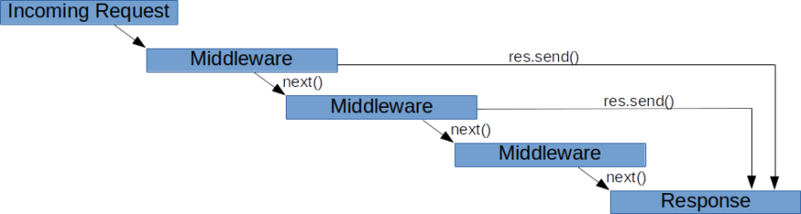

# Node - Custom Middleware


## Custom middleware for user authorization

@students: 
- students portal includes a very detailed explanation, they may find it useful (login process, sessions, etc  )


Explain:
- middleware
  - 

- custom middleware
  ```js
  app.use( (req, res, next) => {
    console.log("hello world")
    //next();
  });
  ```

- middleware as an intermediate argument in our routes. eg:
  
  ```js
  router.get('/admin', isUserLoggedIn, () => {
    ...
  })
  ```

- Implement protected routes
  
  ```js
  const isLoggedIn = (req, res, next) => {
    if(req.session.currentUser){
        next();
    } else {
        res.redirect("/login")
    }
  }
  ```

- Protect C+U+D books

- Extract the middleware function to a separate file
  - Example: https://github.com/ironicHackers-Ironhack-Sept-22/ironic-library-project/commit/bb74239f42168550651a132c089f77cd165bbff4


## Ironlauncher with Auth boilerplate

- Command: `npx ironlauncher just-a-demo --auth`
  - IMPORTANT: remind students to select the option "views"

<!--

  In case "ironlauncher --auth" didn't install dependencies correctly:

  - npm install bcrypt@5.1.1 connect-mongo@5.0.0 cookie-parser@1.4.6 dotenv@16.3.1 express@4.18.2 express-session@1.17.3 hbs@4.2.0 mongoose@7.5.0 morgan@1.10.0 serve-favicon@2.5.0 

  - npm install nodemon@3.0.1 --save-dev

-->


- Demo: run & explain what it has created
  - package.json
    - scripts 
    - dependencies (bcryptjs + connect-mongo + express-session)
  - /config/index.js added configuration for sessions
  - /routes/auth.js
    - signup
    - login
    - logout
      - note: it's a GET request
  - IMPORTANT: 
    - see that routes are mounted in `app.js` (ex. on top of "/auth")
    - ex. `/auth/signup`
  - /middlewares


- Students can use that to generate project2

