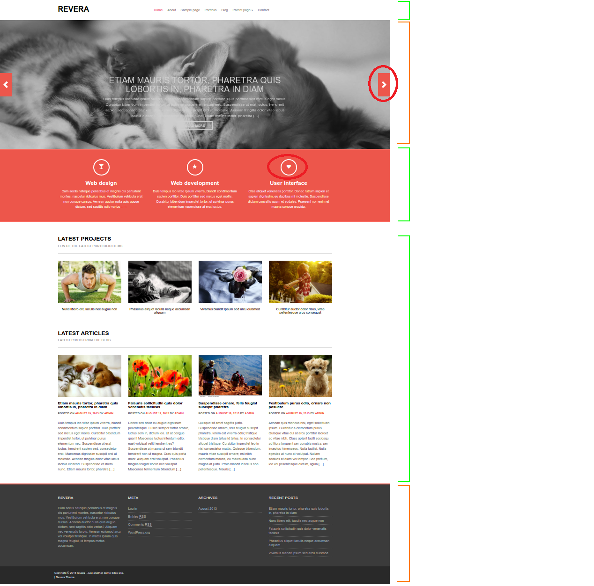

# LAB - Bootstrap Cloning Revera

How: pairs (same pairs as in project2)

<!--
@Luis: TRY TO USE SAME PAIRS AS PROJECT 2
-->

## Priorities

- Focus on practicing bootrstrap (ex. grid)
- For this lab, do not worry about low level details (ex. font size, font family etc)

Priorities for this lab:

