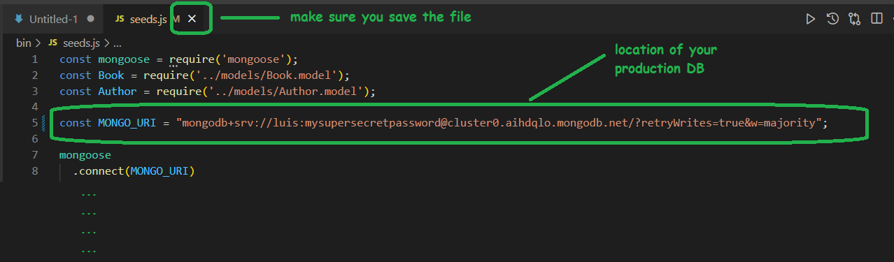

# Deployment m2

Legacy 2 (recording): MongoDB Atlas + Adaptable.

<!--

Status: ready

Slides (shown in the video):
https://docs.google.com/presentation/d/1tHpGGAFdEy9lKv87Qs7uzs4UfQAXGOCSHyXzHQ4RIDU/edit#slide=id.g138c040071e_0_0

-->

## Day Planning:

- 9am: Deployment (self-guided video)
  - If you have errors while following the video, try to understand what is happening. 
  - If you can not solve it, ask for support.

- 2pm: Q&A in the main room

- Standup (after Q&A)

- Submit URLs in the students portal (Deadline: today, 5pm) 
  - IMPORTANT:
    - Those are the urls for project 2 (ie. not the library project)
    - Make sure to submit the correct urls
    - It's Wed., it's normal if there's bugs (but make sure to submit).

## Project 2 Deployment

⛳ Follow instructions in this video:
https://www.loom.com/share/f905d44b81414eeeb5c6ddf0715ae3c5

📝 Update Sept. 2023:

- MongoDB Atlas has changed some details on their website (some pages are slightly different). 
- You should be able to follow all steps without any problem but, in doubt, let us know.

- (minor) MongoDB Atlas has dome some changes in the UI:
  - example from the video: https://drive.google.com/file/d/1noGvA2uOzr7xTo-gm91aEA9X_C9yHkkq/view?usp=sharing
  - example of their new interface: https://drive.google.com/file/d/1KU6Rg5fM-bm3ZfTBmIOABlq8BlEp2cod/view?usp=sharing

📌 Links & other things I mention in the video:

- Library project (in case you don't have your own) https://github.com/ironhack-rmt-resources/library-project-deployment-demo
- MongoDB Atlas --> https://account.mongodb.com/account/login
- Pattern for all ip address: 0.0.0.0/0
- Adaptable --> https://adaptable.io/app/signin
- Cheatsheet branches --> https://gist.github.com/luisjunco/d9d0a7d62e7633568533b7214f6af840

<!-->

- share also instructions for seeds file 
- ask students to submit URLs in the students portal (set DEADLINE)
- (interesting) explain how we can see production DB & local DB on Compass (I don't mention it explicitly in the video)

-->

<!--

Things missing in the recording:

1. Testing with Compass
  - how we can see production DB
  - how to switch between local & production on Compass

2. Emphasize that, if they have any bug in localhost, it will also be in production (but it shouldn't be the other way around). Give an example

-->

## Seed file (seed data on production DB)

<!-- share instructions on Slack (no need to demo) -->

To seed data on production, you can do the following:

  1. Modify your seeds file so that it points to the production DB (see screenshot)
    - Note: save the changes on this file but do NOT make a commit.

  2. Execute your seeds file in your computer: `node bin/seeds.js`

  3. Confirm that data was created on production (you can do that on MongoDB Compass, connecting to your production DB)

  4. Undo the changes we made in "step 1" (so that they are not added to the repo)
  - Note: this step is important, otherwise you may be pushing your DB credentials to github.

  

## Notes: MongoDB Atlas

- Worth to mention (I don't mention that explicitly in the video)
  - how we can see production DB
  - how to switch between local & production on Compass

- For up-to-date steps & screenshots: check students portal.

- If doing deployment for PROJECT 3: 
  - we need to create a new project (limit of one free cluster per project)

## Notes: Adaptable

Mentioned in the video:

- if you have an organization, make sure all members are owners of the github organization.
- git repo must be in same directory as package.json (if not, it can be configured on adaptable)

- Choose a Deploy Template: "Express App Template"

- Choose Database Type: "NONE" (deploy will be a bit faster)

Not explained in the video:
- how to how to trigger new deploy manually: "update deployment"

Some other notes:

- (not very common) one of the students reported it was due to being members of a github organization with a huge number of members (when they left that organization, the issue was solved).

## (Extra) Keep me alive

https://github.com/Sepidehatt/KeepMeAlive-hbs-version

<!--

(Keep me alive):

- test in detail + integrate in our deployment day planning.

- Model.countDocuments() instead of .find() (less chances of students returning the response from DB)

-->

