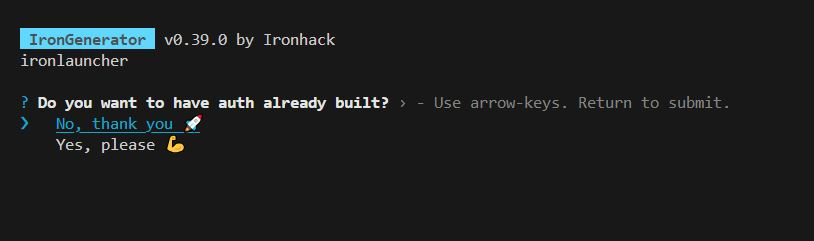

# w7d4

## Day planning

- LAB Q&A [20m]

- Refresh main contents we've seen this week [30m]
  - routes 
    <!-- 
      @LT: 
      - do this demo with async/await
      - can also do it on a branch
    -->
  - req.params, req.query, req.body
  - mongoose
    - schema, model
    - mongoose methods
  - populate

    <!-- alternative: provide a 30m. recording -->

- Explain: relationships [1h]
  - type of relationships (1:1, 1:many, many:many)
  - embedded documents
  - references
  - recommendations
  - Cheatsheet: https://gist.github.com/luisjunco/a507e9f15acb32620cf8a33fff0904b1

- refactor: extract some routes to specific files [30m]
  - example: https://github.com/ironhack-sept2024-devstructors/express-iron-restaurant/commit/cd281f2d8ec21541734e2914378f60f6ca30f6ee

- explain: plan today + tomorrow.
  - today:
  - tomorrow: will be demanding (auth)

- (skip) Ironlauncher
  <!-- @LT: do this w8d2 instead -->

- Intro to "Express | REST API" [1h]
  - see list of topics to cover below

- (Self-guided) Express | REST API
  - see notes below.

  

## Intro to "Express | REST API"

Explain: why is important to do it self-guided (since we're approaching the end of the bootcamp).

Refresh REST [10min.]
- slides: https://docs.google.com/presentation/d/194i1dCV2vpqTN5T3yC5lysvfS-_fnEkok97QpaOtb3w/edit?usp=sharing
<!-- note: can also this part (the unit in the students portal includes guidelines for REST) -->

Explain: how to extract routes to specific files
- Explain on the app from yesterday.
- example: https://github.com/ironhack-sept2024-devstructors/express-iron-restaurant/commit/cd281f2d8ec21541734e2914378f60f6ca30f6ee

Explain: some other topics that they'll find in "Express | REST API"
- push: `Project.findByIdAndUpdate(projectId, { $push: { tasks: newTask._id } }`
- Validation: `mongoose.Types.ObjectId.isValid(projectId)` (check if format is valid, even if it doesn't exist in the db)

Quick intro to "IronLauncher"
- In the unit "Express | REST API", the initial code is created with ironlauncher
- When you generate the app, you will be asked if you want to have auth. Choose `No, thank you 🚀`
- 

## Active Learning / Afternoon

<!-- @LT: workload to do this 3 things (self-guided + mini-project + recording) is very reasonable, specially if we finish lectures by 1pm -->

1. Submit project preferences
  - Deadline: tomorrow 10am.

2. "Express | REST API"
    <!-- Follow the steps in this unit, starting from the section "Project Management API" -->
    - How: individual or in pairs (same groups that we use for mini-project)

3. Mini Project - REST API - Day 4

4. Watch Recording "Auth: intro and hash algorithms" (1h): 

  - English (dec. 2023): https://www.loom.com/share/99e0abae2c9346a3ba84d1e178c06b48?sid=e471b840-b8a6-44a1-9070-4f5a5f662518

Recordings in spanish:

- Auth 1 - ES - intro y algoritmos de hash: https://www.loom.com/share/be9b43442d9c46748834b450d76d8aa9?sid=b09a8669-362b-4870-93dd-f6944e8bac86

- Auth 2 - ES - bcrypt demo: https://www.loom.com/share/92e9d844cdc14d3fb473b7f7f8476ea3?sid=6fb03430-de2a-454c-a7e7-e0e6df0b8de2

Bonus: 
- Implement your routes with `async/await` instead of `.then().catch()`

<!-- 
Extra bonus:
1. Research about the MVC pattern (Model-View-Controller)
2. Follow this video and apply the concept to your Express app: https://www.youtube.com/watch?v=SOLgvMxSpgA
-->

