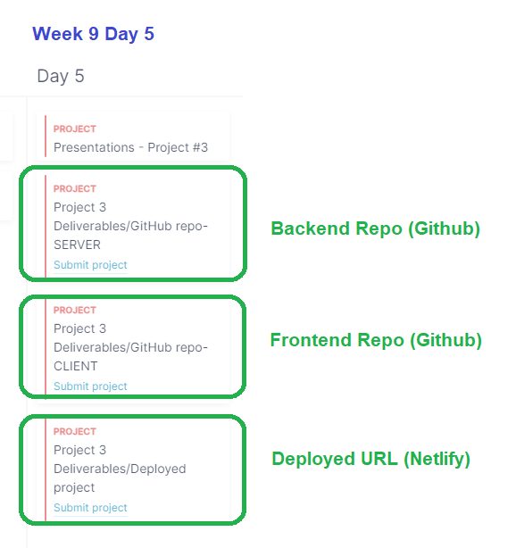

# Module 3 Deployment

<!--

Status: 

Slides (shown in the video):

-->

## REQUIREMENTS

- repos (client + server)

## Day Planning:

- 9am: Deployment (self-guided video)
  - If you have errors while following the video, try to understand what is happening (if you can not solve it, ask for support).
  - You can also send a request if you want to clarify any point.

- 2pm: Q&A in the main room

- standup (after Q&A)

- Submit URLs in the students portal. Deadline: 5pm

- Note: it's Tuesday, it's normal if there's bugs (but make sure to submit URLs + make sure you submit the correct URL).

## Project 3 Deployment

⛳ Follow instructions in these three videos:

Using env variables for the location of our API
https://www.loom.com/share/52429b07880c44b2801956d42dcd2e06

Intro + Server:
https://www.loom.com/share/45058811db3640a2944046a8ffb8cba4

Client + Summary:
https://www.loom.com/share/1503025f85344dacad7e914cc759ceba

➡️ IMPORTANT: working in pairs
  - Make sure both of you follow the steps for deployment.

➡️ IMPORTANT: environment variables prefix:
  - CRA: `REACT_APP_`
  - Vite: `VITE_`

➡️ Update Sept. 2023:

- MongoDB Atlas and Netlify have changed some details on their website (some pages are slightly different). 
- You should be able to follow all steps without any problem but, in doubt, let us know.

- (minor) MongoDB Atlas has dome some changes in the UI:
  - example from the video: https://drive.google.com/file/d/1noGvA2uOzr7xTo-gm91aEA9X_C9yHkkq/view?usp=sharing
  - example of their new interface: https://drive.google.com/file/d/1KU6Rg5fM-bm3ZfTBmIOABlq8BlEp2cod/view?usp=sharing

- (minor) Netlify has changed the UI:
  - old interface (horizontal menu): https://drive.google.com/file/d/1GSaam-vABRarKLaq3lzjS-zF5JwKH8-M/view?usp=sharing
  - new interface (sidebar): https://drive.google.com/file/d/1wAfkU8PEIgJ-plGQkLIqbjbG5P9HGo3I/view?usp=sharing

📌 Repos that I use (in case you don't have your own):

- Server: https://github.com/ironhack-rmt-resources/project-management-server-deployment-demo

- Client: https://github.com/ironhack-rmt-resources/project-management-client-deployment-demo

📝 Links & other things I mention in the video:

- Pattern for all ip address: 0.0.0.0/0

- To avoid treating warnings as errors: `CI = false`

- To fix error when user doesn't go directly to the homepage of our react app, create a file `_redirects` (needs to go in /public directory) with this content:   `/*  /index.html  200`

- Note: if you are on Mac, make sure the filename (`_redirects`) does not contain a whitespace at the end.

- Cheatsheet branches --> https://gist.github.com/luisjunco/d9d0a7d62e7633568533b7214f6af840

## Submit URLs in students portal

Ask students to submit URLs in the students portal (set DEADLINE)

## Seed file (seed data on production DB)

<!-- @LT: share instructions on Slack (no need to demo) -->

